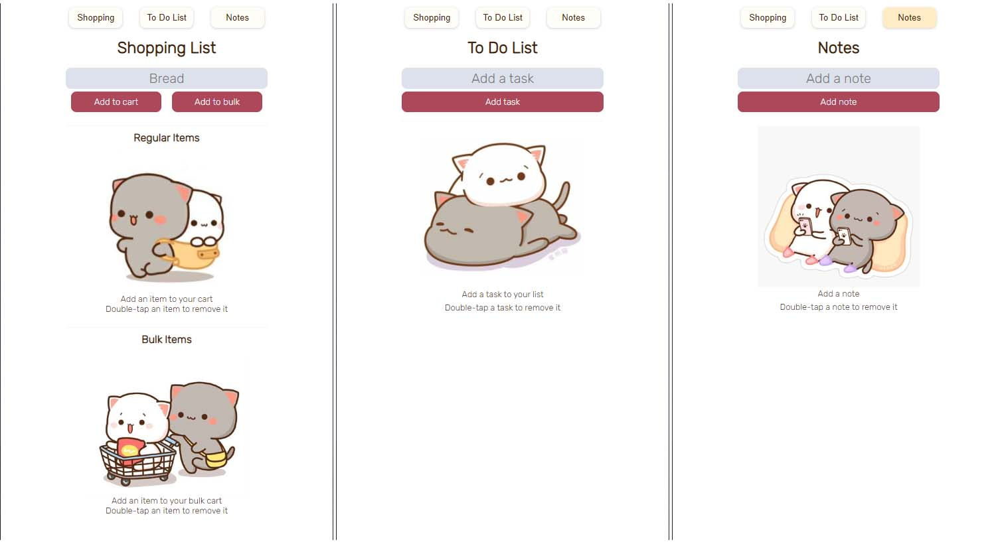

# Task List

This is a personal project to centralize tasks with my family. It has 3 main sections:

- A Shopping list
- A To-Do list
- A Notes section

The shopping list is separated into a general section and a bulk (Costco) section. Data is stored in a Firebase Realtime database and updates in realtime so that if someone makes a change, that change immediately propagates to anyone else using the app. Otherwise, the changes are all rendered when the app is next opened. This means that if I add an item to the shopping list from my computer, my sister can see that change immediately on her phone from the parking lot at the store. If my daughter adds something to the to-do list from her tablet, I can see it immediately on my computer or phone, and so on.

There are two deployed versions of the app. One is for my family's use. The one that's shared below is for public consumption. It's also a progressive web application (PWA), so it acts like a native web application on Android or Apple phones. It can be saved to the phone with it's own icon and launches like a native app.

Public deploy: https://vish213-task-list.netlify.app/

## JavaScript concepts

- module imports & exports
- variables
- objects
- document
    - .getElementById()
- arrays
    - .forEach()
    - .push()
    - .find()
- functions
    - event listeners
    - event handlers
    - arrow functions
- if statements
- if/else statements
- element
    - .addEventListener()
        - click
        - dblclick
        - keypress
    - .value
    - .innerHTML
    - .innerText
    - .classList
        - .add()
        - .remove()
- events
    - event.target
    - event.target.id
    - event.key
- .toLowerCase()
- return
- string template literals
- Object.entries